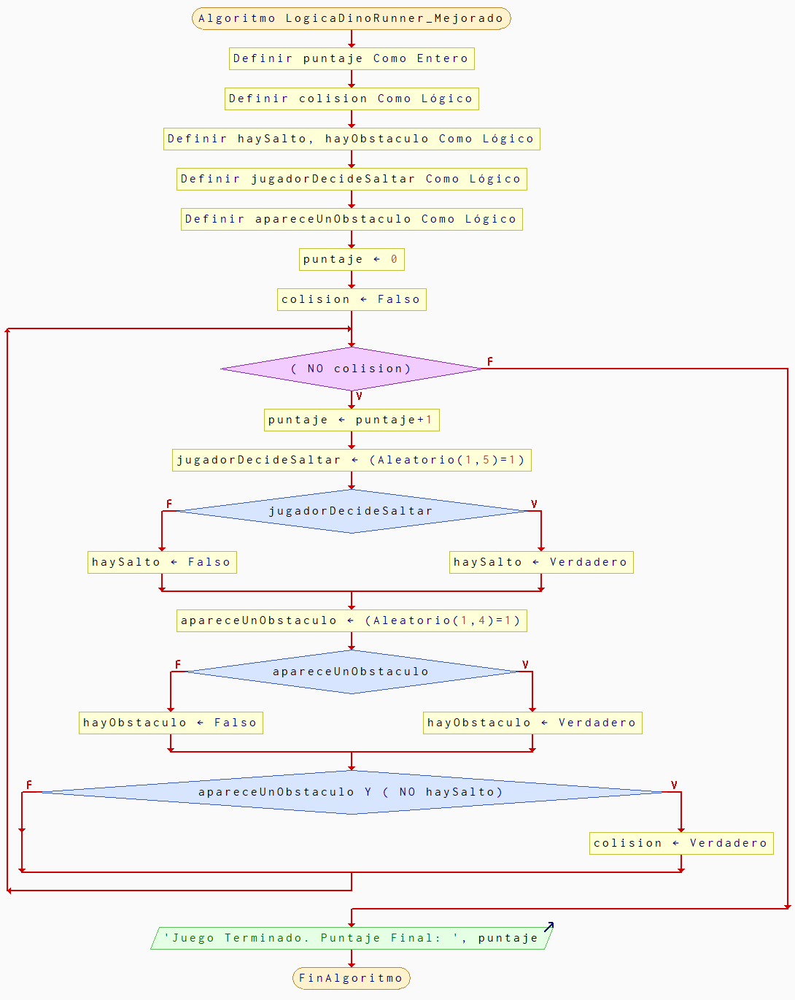

# Dino Runner

## Historia del Juego
El jugador controla a un dinosaurio que corre automáticamente por un paisaje desértico. El objetivo es evitar obstáculos como cactus y aves saltando o agachándose, intentando sobrevivir el mayor tiempo posible.

## Reglas y Mecánicas del Juego
- El dinosaurio corre automáticamente de izquierda a derecha.
- Al presionar la tecla espacio o hacer clic, el dinosaurio salta para evitar obstáculos.
- El jugador pierde si el dinosaurio choca contra un obstáculo.
- El juego mide el tiempo/duración y puntaje según los obstáculos esquivados.

## Algoritmo del Juego
1. Iniciar el juego y mostrar al dinosaurio en pantalla.
2. El escenario y los obstáculos comienzan a moverse hacia la izquierda.
3. Detectar entrada del jugador para saltar.
4. Generar obstáculos de manera aleatoria.
5. Comprobar colisiones entre dinosaurio y obstáculos.
6. Si hay colisión, terminar el juego y mostrar puntaje.
7. Si no hay colisión, continuar el juego e incrementar el puntaje.

## Diagrama de flujo

## Prompt

Crea una versión web interactiva del juego Dino Runner usando HTML, CSS y JavaScript. El juego debe mostrar un dinosaurio que corre y salta obstáculos, aumentando el puntaje por cada obstáculo esquivado. El juego termina si hay una colisión. Elige gráficos simples, ideal tipo pixel art.

## Link de la conversacion
https://chatgpt.com/share/68e8898d-b3d0-800a-9973-c9fd31da5218

## Juego web generado por IA

[Jugar Piedra, Papel o Tijeras (Web)](https://jemilio1407.github.io/entregas-lenguajes-interpretados/index.html)