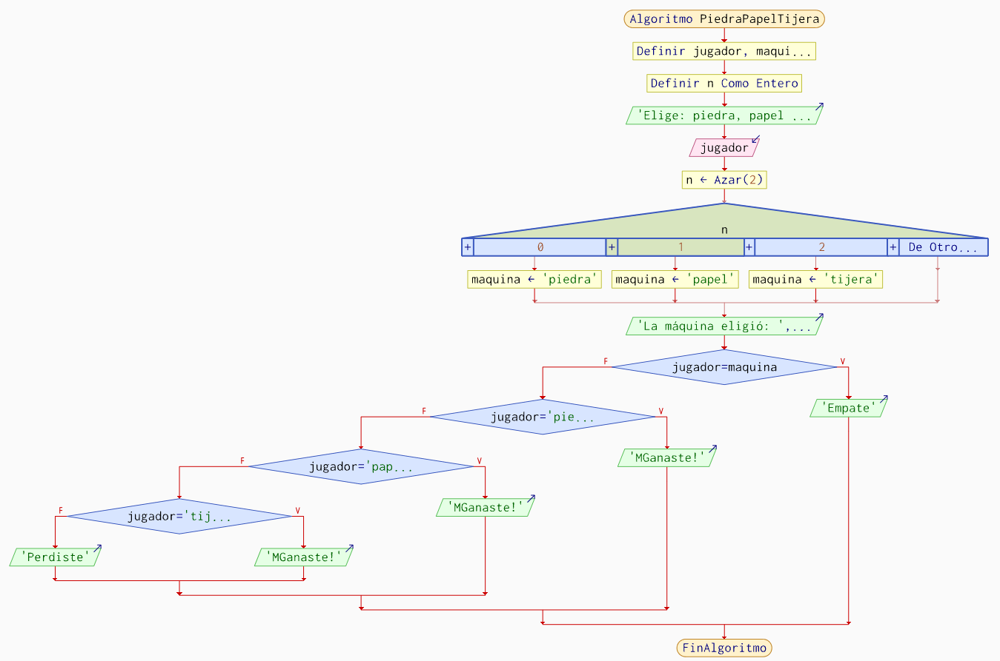

# Piedra papel o tijeras
## Historia
El clásico juego “Piedra, Papel o Tijeras” es un juego milenario usado para la toma de decisiones entre dos jugadores. Su origen es incierto, pero se cree que se popularizó en Asia antes de difundirse por todo el mundo. Ahora se utiliza como método sencillo para resolver disputas en cualquier contexto.

## Reglas y mecanicas
1. Dos jugadores eligen entre piedra, papel y tijeras al mismo tiempo.
2. Piedra vence a tijeras.
3. Tijeras vence a papel.
4. Papel vence a piedra.
5. Si ambos eligen la misma opción, es empate.

## Algortimo del juego
1. Entrada del jugador: El usuario elige entre “piedra”, “papel” o “tijeras”.
2. Elección aleatoria para la máquina: La máquina escoge una opción basado en un número aleatorio.
3. Comparación de opciones:

    Si las opciones coinciden, es “Empate”.

    Si no hay empate, se comparan las opciones del jugador y la máquina:

    Si jugador elige “papel” y la máquina “piedra”, gana el jugador.

    Si jugador elige “piedra” y la máquina “tijeras”, gana el jugador.

    Si jugador elige “tijeras” y la máquina “papel”, gana el jugador.

    En cualquier otro caso, pierde el jugador.

## Diagrama de flujo

## Prompt
Crea una página web solo usando HTML (solo HTML, no uses JS ni CSS en archivos separados) que implemente el juego Piedra, Papel o Tijeras siguiendo este esquema:
El usuario elige entre piedra, papel o tijeras con botones.

La máquina elige aleatoriamente entre las tres opciones.

Aplica la lógica del juego según este diagrama de flujo:

Si ambas opciones son iguales, muestra "Empate".

Si jugador elige “papel” y la máquina “piedra”, gana el jugador.

Si jugador elige “piedra” y la máquina “tijeras”, gana el jugador.

Si jugador elige “tijeras” y la máquina “papel”, gana el jugador.

En cualquier otro caso, gana la máquina.

Muestra el resultado cada vez que se juega. Usa solo un archivo HTML autoconclusivo.