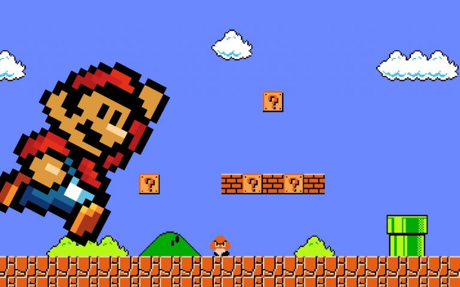
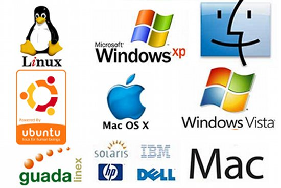

# Asignaturas 3DEVs

## Proyecto app

### Profesor: Eduardo Guerrero

En esta materia estamos viendo e ideando el juego en 2D para telefono, ver que se ocupa y decidir como va a ser.

## Sistemas operativos

### Profesor: Alcides Albora

En esta materia estamos aprendiendo a usa los distintos softwares que hay pero por el momento nos estamos centrando en Ubuntu.

