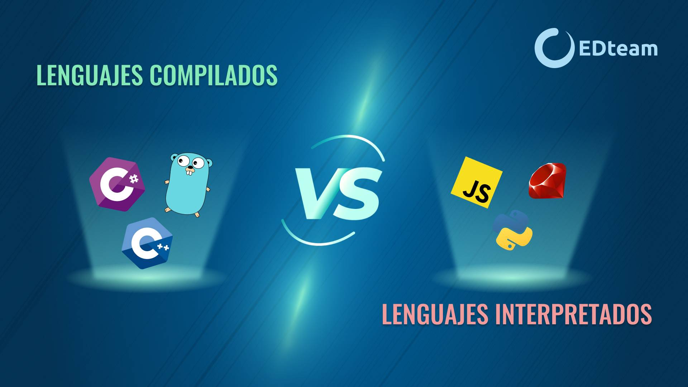

# Asignaturas 3DEVs

## Programacion en lenguajes interpretados 
### Profesor: Jonathan Mircha
En esta materia estamos aprendiendo a usar la mejor manera git y github ya que usando estos programas las cosas como programar en equipos se vuelve mas sencillo y eficiente.

